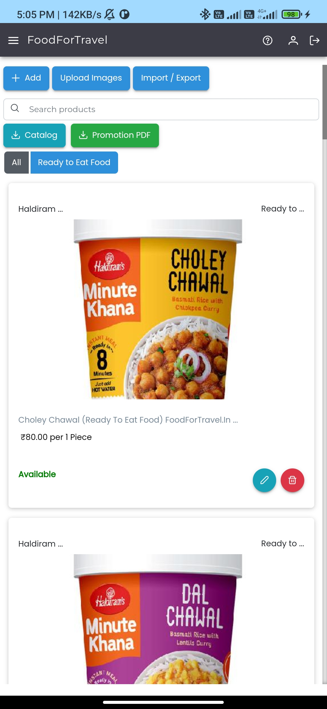
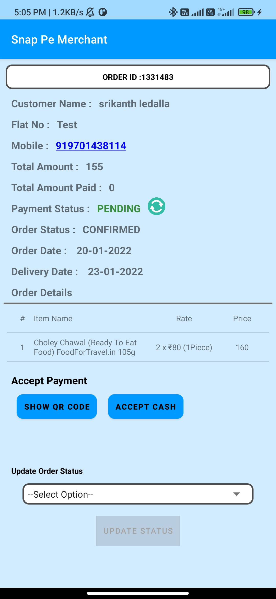
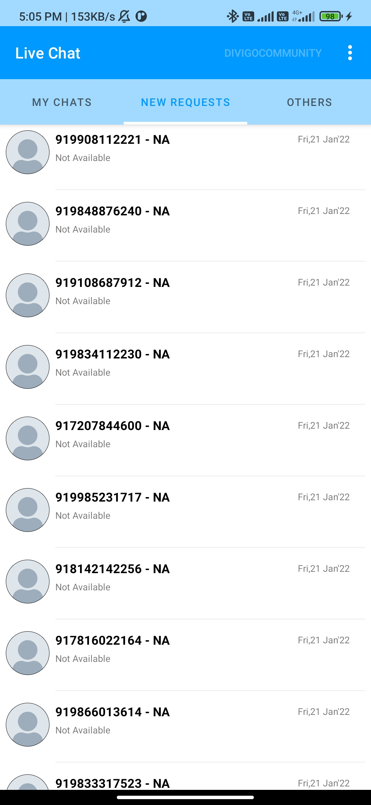

# Snap Pe Merchant (Android_Java) <a href="https://play.google.com/store/apps/details?id=com.divigo.snappemerchant">- On PlayStore</a>

This is Flutter based Application, which is using for create own online Shop in http://snap.pe/.
With the help of this app Merchant can create own Catalogue and order and also they can manipulate them.

  
  
  
  
  

